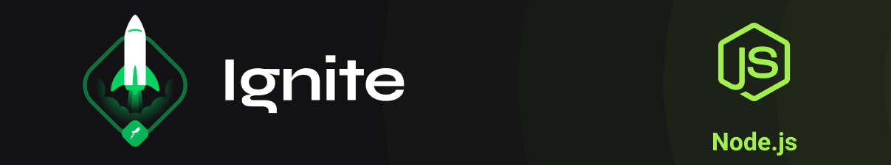

<p align="center"></p>
<h1 align="center">Typescript</h1>


<h1 align="center">
  
  

   
 
  <a href="./license.md">
  
  </a>
</h1>

# Índice

- [Sobre](#-ℹ️-sobre)
- [Tópicos](#-📁-tópicos)
  - [Criando projeto com typescript](#-➡️-Criando-projeto-com-typescript)
  - [Adicionando os tipos](#-➡️-adicionando-os-tipos)
  - [Definindo os parâmetros obrigatórios](#-➡️-Definindo-os-parâmetros-obrigatórios)
- [Como rodar o projeto](#-⚙️-Como-rodar-o-projeto)
- [Autora](#-👩‍💼-autora)
- [Licença](#-📝-licença)

<br>

# ℹ️ Sobre

Primeiros passos na criação de aplicação usando Typescript.

<br>

# 📁 Tópicos

## ➡️ Criando projeto com typescript

- inicializar o projeto
- instalar como dependência: `express`
- instalar como dependência de desenvolvimento: `@types/express` ⇒ tipagem necessária quando se utiliza typescript
- criar a pasta principal do projeto: `src`
- criar o arquivo `server.js` na pasta `src` e fazer as primeiras configurações
- instalar como dependência de desenvolvimento: `typescript`
- iniciar o typescript: `yarn tsc --init`
- Alterar o arquivo tsconfig.json para definir a pasta onde serão criados os arquivos `.js` que são entendidos pelo node
- **Testar**
  - Rodar o typescript para conversão do arquivo `ts` em `js` => `yarn tsc`
  - Rodar a aplicação => `node dist/server.js`

## ➡️ Adicionando os tipos

- criação do serviço ⇒ `CreateCourseService.ts`
  - receber os dados para criação do curso
  - dados:
      - name - string
      - duration - number
      - educator - string
- para testar criar uma rota ⇒ `routes.ts`
- **Testar**
- Outra maneira de realizar o mesmo serviço, de maneira que os dados não tenham que ser inseridos exatamente na ordem que aparece no service é criando uma **interface**
- A `interface` cria uma casca com todos os atributos que poderão ser recebidos
- **Testar**

## ➡️ Definindo os parâmetros obrigatórios

- garantir que os atributos sejam obrigatórios ou opcionais
  - para que um atributo seja opcional, incluir na interface o ponto de interrogação `?`
- definir um valor default para um atributo
  - se não for informado nenhum valor, o valor seja o definido por `default`
- **Testar**
  - criar um novo curso sem atribuição da duração

<br>

# ⚙️ Como rodar o projeto
```bash
# Clonar o repositório

$ git clone https://github.com/nlnadialigia/ignite-typescript.git

# Entrar na pasta

$ cd ignite-typescript

# Instalar as dependências

$ yarn 

# Emular os arquivos typescritp para que rodem no node

$ yarn tsc

# Iniciar o projeto

$ node dist/server.js
```

### 📌 Para testar basta acessar o browser com o endereço: http://localhost:3350
- além da mensagem mostrada na tela, os dados cadastrados serão informados no terminal.

<br>

# 👩‍💼 Autora
<br>

 
<p><b>Nádia Ligia, desenvolvedora back-end em formação.</b></p>

<a href="https://www.linkedin.com/in/nlnadialigia/">
  
</a>&nbsp;
<a href="mailto:nlnadialigia@gmail.com">
  
</a>&nbsp;
<a href="https://www.nlnadialigia.com">
  
</a>

<br><br>

# 📝 Licença

Esse projeto está sob a licença MIT. Veja o arquivo [LICENSE](./LICENSE) para mais detalhes.
